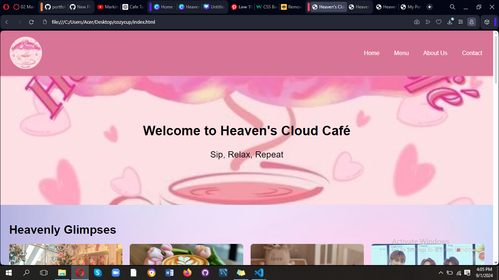
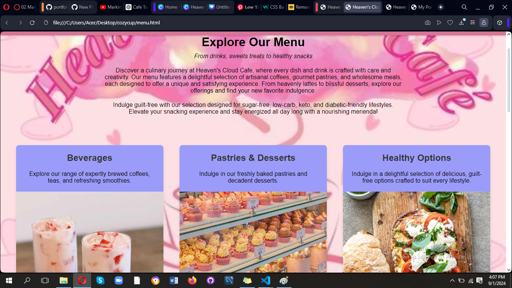

# Heaven's Cloud Cafe

## Project Description
Heaven's Cloud Cafe is a serene and cozy oasis offering a delightful selection of artisanal coffees, teas, and freshly baked pastries. This project captures the essence of the cafe through a beautifully designed website that showcases its menu, events, and more. The website is user-friendly, visually appealing, and crafted to provide an immersive experience for visitors.

## Features
- **Beautifully Designed Menu Page:** A detailed menu with categories for cakes, desserts, coffee, lattes, teas, and shakes, featuring cute and creative descriptions.
- **Events Section:** A list of upcoming events at the cafe with engaging descriptions to attract customers.
- **Gallery Page:** "Heavenly Glimpses" showcases the cafe's interior, baristas, cakes, and coffee.
- **Limited Time Specials:** A dedicated section highlighting seasonal and exclusive menu items.
- **Responsive Design:** Optimized for a seamless experience on both desktop and mobile devices.

## Screen Captures

*The welcoming home page provides an overview of what Heaven's Cloud Cafe has to offer.*

*The menu page displays a beautifully organized selection of the cafe's offerings, with creative descriptions for each item.*

**

**

## About the Authors

**Name:** Carmela Marie R. Javero
**Email:** 202080472@psu.palawan.edu

